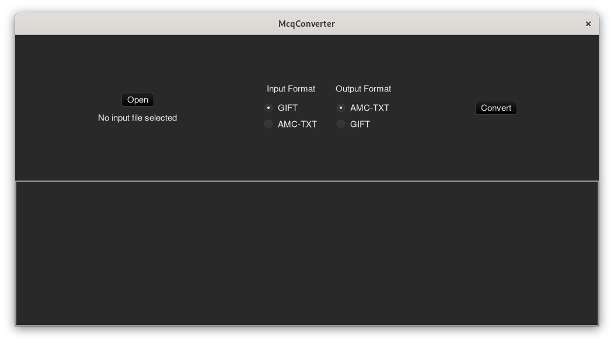

# McqConverter

McqConverter is a [MCQ](https://en.wikipedia.org/wiki/Multiple_choice) format converter written in pure Rust.

My code is surely not perfect, do not hesitate to make a [pull request](https://github.com/SilentVoid13/McqConverter/pulls), to fill an [issue](https://github.com/SilentVoid13/McqConverter/issues), or to contact me for any problem / code enhancement suggestion at [silentvoid13@protonmail.com](mailto:silentvoid13@protonmail.com).

## Supported Formats

McqConverter currently supports the following formats :

- [AMC-TXT](https://www.auto-multiple-choice.net/auto-multiple-choice.en/AMC-TXT.shtml)
- [GIFT](http://docs.moodle.org/en/GIFT)

You can suggest me a format that you want me to add.

## Usage

This repository contains 4 sub-projects.

### mcqconverter_gui

This is a GUI application that allows users to select and convert any of their files to the desired format.



### amctxt2gift

This is a console application to convert a file from the AMC-TXT format to the GIFT format

```bash
USAGE:
    amctxt2gift [FLAGS] [OPTIONS] <FILE>

FLAGS:
    -c, --convert_comments    Enables comments conversion (default: not enabled)
    -h, --help                Prints help information
    -V, --version             Prints version information
    -v, --verbose             Sets verbose output

OPTIONS:
    -o, --output <FILE_PATH>    Sets the output file name (default: [FILE].gift)

ARGS:
    <FILE>    Sets the input file to convert
```

### gift2amctxt

This is a console application to convert a file from the GIFT format to the AMC-TXT format

```bash
USAGE:
    gift2amctxt [FLAGS] [OPTIONS] <FILE>

FLAGS:
    -c, --convert_comments    Enables comments conversion
    -h, --help                Prints help information
    -V, --version             Prints version information
    -v, --verbose             Sets verbose output

OPTIONS:
    -o, --output <FILE_PATH>    Sets the output file name (default: [FILE].amctxt)

ARGS:
    <FILE>    Sets the input file to convert
```

### mcqconverter_core

This is the core library used to make all the conversions used by all the other projects. This project is not useful for users.

## Binaries

You can either get the compiled version from the latest [release](https://github.com/SilentVoid13/McqConverter/releases), from the [bin](https://github.com/SilentVoid13/McqConverter/tree/master/bin) directory, or compile it yourself using `cargo` :

```bash
cargo build --release
```

Your binaries will be available in the `target/release` directory.

This application has only been tested on Linux and Windows 64-bit.

## Contributing

Feel free to contribute.

## License

McqConverter is licensed under the GNU AGPLv3 license. Refer to [LICENSE](https://github.com/SilentVoid13/McqConverter/blob/master/LICENSE.txt) for more informations.